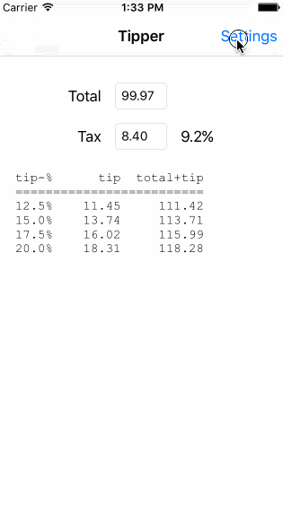

ios Tipper
==============

This is an iOS demo application for calculating tips

Time spent: 8 hours spent in total

Completed:
---
 * [x] Required: Implement view controllers for main and settings screens
 * [x] Required: Add readme
 * [x] Required: Add screen capture
 * [x] Optional: Extract tipping logic into separate class
 * [x] Optional: Unit tests for tipping logic
 
Features:
---
 * Allow entry of total bill amount
 * Allow separate entry of tax amount
 * No tip on tax: calculate tip amount bases on total, excluding taxes
 * Settings enable:
  * Exact tipping, penny accurate tip. e.g. when using a credit card
  * Cash tipping, tip amount rounded to whole number. e.g. when leaving a cash tip
  * Cash payment, grand total rounded to whole number. e.g. when paying everything cash
 
Walkthrough of the features:
---
Note the rounding of the different amounts.

